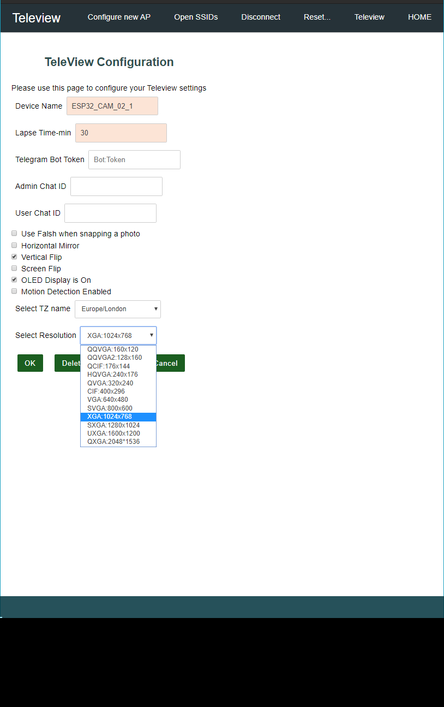

# TeleView:
	A telegram-bot project to control an ESP32-Camera enabled board with many features.

- [TeleView:](#teleview)
  - [Main features and snapshots](#main-features-and-snapshots)
  - [Generic Features:](#generic-features)
  - [Specific Features per Type of Board:](#specific-features-per-type-of-board)
  - [Tested Boards:](#tested-boards)
  - [Required Installation:](#required-installation)
  - [Required Libraries:](#required-libraries)
  - [User Guide:](#user-guide)
    - [Compile and Upload](#compile-and-upload)
    - [Enabling Disabeling Features at compile time](#enabling-disabeling-features-at-compile-time)
    - [Setting up the WiFi:](#setting-up-the-wifi)
    - [Setting up the Telegrambot:](#setting-up-the-telegrambot)
    - [Having more than one user to use the bot:](#having-more-than-one-user-to-use-the-bot)
    - [Having multiple boards to use the same bot token:](#having-multiple-boards-to-use-the-same-bot-token)
  - [The Telegram Keyboard](#the-telegram-keyboard)
  - [The Configuration Web interface](#the-configuration-web-interface)
    - [http://TeleView.local/](#httpteleviewlocal)
    - [http://TeleView.local/_ac](#httpteleviewlocal_ac)
    - [Intput Text](#intput-text)
    - [CheckBoxes:](#checkboxes)
    - [ComboBoxes:](#comboboxes)
    - [Buttons:](#buttons)
## Main features and snapshots
* Send Photo through telegram upon request.


* Control camera options through Telegram Keyboard


* Control camera resolution Inline keyboard:


* View options through Telegram 


* Web interface



## Generic Features: 
* Sends Photo through telegram upon request.
* The telegram bot responds to the ADMINID or UserID (find your telegram CHATID through https://web.telegram.org/#/im?p=@chatid_echo_bot )
* Control options with Telegram :
	* Generic features: Camera Resolution, Camera-Flip ,Camera-Mirror ,image-resolution ,Time-Lapse and send photo.
	* Board Specific Features: Flash ,OLED display enable, OLED as Flash, Screen Flip,Motion Detector.
* Telegram Keyboard.
* AutoConnect / WiFi config feature (no hard coding of the WiFI SSID,Pass )
* Web Portal :
	* to configure the control options and WiFi AP.
    * configure Telegram-BOT-Token, AdminID of the BOT
* Web Server for /capture.jpg to make photo available through web. (configurable through Telegram menue)
* The Device-Name (configurable) decides the hostname of the device on LAN/WiFi 
* Time Lapse feature every X min, chose 0 to disable Time-Lapse.
* A deep sleep mode is possible with time-lapse and PIR motiion detection for battery operated scenarios.
* Usual case , only the admin will be notified of the eventd "Alive", "motion detection" and "time-lapse" , but you can also enable alerting of the userId.
* Supports multiple Admins and multiple Users through Telegram Groups (explained further below).

## Specific Features per Type of Board:
* toggle flash when taking a photo : For the AI_Thinker board, there is a very strong led on the same side as camera, which could be used as a flash.
This feature Will only be compiled in the sketch if the "#define CAMERA_MODEL_AI_THINKER"  is chosen upon compile.

* PIR motion detection : For the TTGO_TI board, there is a motion sensor , which could trigger a "sendPhoto". This will only be available when the sketch is compiled with "#define CAMERA_MODEL_TTGO_T1_CAMERA".

* toggle Display : For the TTGO_TI board, there is a SSD1306 OLED display, which could display AutoConnect - AP , IP when connected and used as a weak-flash when taking a photo.
This will only be available when the sketch is compiled with "#define CAMERA_MODEL_TTGO_T1_CAMERA". also you could flip the screen upside-down.

* Save photos to SD as a configurable feature.

## Tested Boards:
* AI-Thinker ESP32-CAM Board
* TTGO T1 Board
* M5 CAM

## Required Installation:
* Arduino IDE
* ESP32 for Arduino IDE https://github.com/espressif/arduino-esp32

## Required Libraries:

* TeleView was tested/compiled with these versions of the libraries. just use the latest and if you face problems, then downgrade to those versions

Library | Version
--------| ---------
ESP32 board libs | 1.0.6
UniversalTelegramBot | 1.3.0
ArduinoJson | 6.17.3
Adafruit GFX Library  | 1.10.7
Adafruit  BusIO | 1.7.3
Adafruit  SSD1306 | 2.4.4
AutoConnect | 1.2.2


## User Guide:
### Compile and Upload 
 This project is Compiled and uploaded through ArduinoIDE, use the normal procedure for installing ESP32 in ArduinoIDE and install the following Libs:
*    AutoConnect
*    ArduinoJson 
*    Adafruit SSD1306 and Dependecies such as Adaruit GFX..etc
*    please check the required libraries section above.

Before uploading, chose the target ESP32-CAM Board :

```CPP
// Select camera model
//#define CAMERA_MODEL_WROVER_KIT
//#define CAMERA_MODEL_ESP_EYE
//#define CAMERA_MODEL_M5STACK_PSRAM
//#define CAMERA_MODEL_M5STACK_WIDE
//#define CAMERA_MODEL_AI_THINKER         // Board definition "AI Thinker ESP32-CAM"
#define CAMERA_MODEL_TTGO_T1_CAMERA      // Board definition "TTGO T1" 
```

### Enabling Disabeling Features at compile time
The "camera_pins.h" has the speces of each board pins and also supported features such as OLED , Flash ..etc
This code has been tested on CAMERA_MODEL_AI_THINKER and CAMERA_MODEL_TTGO_T1_CAMERA modules. please update the camera_pins.h for other boards and more features.
For the CAMERA_MODEL_TTGO_T1_CAMERA borad, please chose the "TTGO T1" and and set Tools-> Partiton Scheme --> Huge App (3MB No OTA/1MB SPIFF)

For example: in "camera_pins.h" inside the section "#elif defined(CAMERA_MODEL_TTGO_T1_CAMERA)", you will find these precompilers:
* #define SDA_PIN 21
* #define SCL_PIN 22
 
* #define I2C_DISPLAY_ADDR  0x3c
* #define USE_OLED_AS_FLASH 1 // the OLED is on the same side as the camera
* #define PIR_PIN           33 //GPIO_INPUT_IO_33 AS312
 
* #define BUTTON_PIN        34

Also a section exists if an Active Buzzer is connected which is triggered with the motion detection.

These precompiler defines, are used upon compilation to utilize or ommit parts of the code depending on the features of the board.

### Setting up the WiFi:
This sektch uses the Autoconnect Arduino library (https://github.com/Hieromon/AutoConnect) to let the user configure WiFi SSID and Password.
When the sketch starts, it looks for a familiar WiFi. If it can't find one, it will start its own Access Point where the owner can connect and configure the WIFI. 
First Time- SSID will be "TeleView" with the password "tv-ei-694"

The AutoConnect library will start a portal wiht the page /config to configure the Wifi and other configuration parameters.

After a scucessfull Wifi connection, the same portal interface will be exposed to the local Wifi. The borad couled be reached on the LAN through the address "{{The Device Name}}.local"

The default Device Name is Teleview and the address would be:
* http://TeleView.local/  : A general Info page
* http://TeleView.local/_ac : The Configuration Portal for AutoConnect
* http://TeleView.local/teleView : The Configuration Portal for The Bot
* http://TeleView.local/capture : a capture of the camera JPEG

### Setting up the Telegrambot:
A Telegram-bot-token is required to use the Telegrambot feature. 
You may follow these instructions to get a Telegram Bot Token through the @botFather.
https://docs.microsoft.com/en-us/azure/bot-service/bot-service-channel-connect-telegram?view=azure-bot-service-4.0

* You will also need to find out your UserId or in Telegram it is refered as ChatID.
This could be acquired through a visit to the @chatid_echo_bot Telegrambot https://web.telegram.org/#/im?p=@chatid_echo_bot 
* Insert the token and the ChatID of the Admin in the web-interface found at the url "http://<youDeviceAddress>/teleView" and save.
* Add the Bot to your telegram contacts.
* Reset your board and you should get an "I am Alive!" messgae from your bot.

### Having more than one user to use the bot: 
Q) If you are a family and would like to have two or more people access and manage the Telegram bot. how can this be preformed?
Q) if I have multiple Bots and want to controll all of them from one place ?

Answer-A) 
Use the Admin_id and User_id for the second user. However remeber that following events are sent only to the chat with the Admin_id:
* I am Alive message
* Motion Detection 
* Time-Lapse

Answer-B) 
Using Telegram Groups:
  1) Create a Telegram group. Let us call it MyCameraBotGroup.
  2) The MyCameraBotGroup has now you only as an administrator.
  3) Add the bot(s) you want in that group and make them admins.
  4) Add your other family members in that group as well and make them admins (if you want them to also send commands).
  5) Edit the rights of the Bots and Members as you please.
  6) type /start in the MyCameraBotGroup group.
  7) the bot(s) will respond with the chat ID of the MyCameraBotGroup (notice the chat_id of the group has a negative number) for example  ('' from -1234567890..)
  8) Now go to the WebUI and put the chat_id of the group (don't forget the negative sign) in the "Admin Chat ID" textbox.
  9) Now anyone in that group can request a photo with /sendPhoto and other options as the same when using a single user.
  10) All "I am Alive!" events, Motion Detection and time lapse activities will be sent to that group as well.

### Having multiple boards to use the same bot token:
As far as I tested, this also works as a way to manage multiple boards at the same time. However you will not be able to figuire out which board is sending the "photo" , "I am Alive!" or "motion detected" events.
## The Telegram Keyboard
Most of the buttons in the telegram Keyboard are on/off options. 

Command 	  |   Description
:------------ |  :----------------
/start		  | 	Press this on the first time you use the bot , it will show some helpful info.
/options    | 	Will show the current status of the differnt options and flags.
/sendPhoto  | 	Sends a photo to the requester.
/vFlip	  |	Flips the camera-image upside down.
/hmirror    |	Mirror the camera-image . (unfortunately; there is no 90 degrees rotate )
/setLapse   | 	It will ask to insert the lapse time in minutes. insert 0 to disbale, 60 for every 1 Hour, 1440 for once a day ...etc
/webCaptueon	|	This will disbale/enable the ./capture and ./capture.jpg urls.

Will only be shown in TTGO_T1 : (or when enabled in camera_pins.h)
Command 	  |   Description
:------------ |  :----------------
/screenOn	  |	Use the screen to display useful information or switch it off.
/screenFlip	  |	Flips the screen upside down.
/motDetectOn  |	Will enable/disable motion detection feature.

Will only be shown when an OLED or Flash led available: (or when enabled in camera_pins.h)
Command 	  |   Description
:------------ |  :----------------
/useFlash	  |	 will enable/disbale using the flash upon a camera snapshot.

## The Configuration Web interface

### http://TeleView.local/ 
This root home page displays a preview of the camera and some basis info. The cog-wheel icon is a link to the AutoConnect portal.

### http://TeleView.local/_ac 
The Autoconnect portal configures the WiFi access and has a link to the bot's configuration page "./teleView". It has the following elements:

### Intput Text
|UI Control          | Description
|:-------------------| :-----------
|Device Name         |The name of the device , this will be used as a DNS entry in the local LAN and identifying the device.
|Lapse Time-min      | Every X min , the board will send a photo to the admin. set this to 0 to disbale time-lapsing feature.
|Telegram Bot Token  | This is the token you get from the BotFather.
|Admin Chat ID       | Telegram commands will only be processed if the Chat_id of the incomming Message is the same as this Admin_id or User_id ( a Security feature ). This could be chat_id of a Person or a Group where the bot is registered as admin.
|User Chat ID        | a second chat_id for controlling Teleview .Motion detection , time lapse and "I am Alive!" message will only be addressed to the AdminID. This could be chat_id of a Person or a Group where the bot is registered as admin.

* If the chat_Id of the incomming message doesn't match either Admin_ID or User_id, then an echo message will be sent back with the chat id of the sender.
### CheckBoxes:
Checkbox | Description
:--------| :------------
Use Falsh when snapping a photo	| 	Enable/Disable using the flash when capturing a photo.
Horizontal Mirror				|	Horizontal Mirror effect on the captured image (left-right).
Vertical Flip					|	Upside down effect on the Captured image.
Screen Flip					|	Upside down of the OLED display.
OLED Display is On			|	Enable/Disable The OLED display.
Motion Detection Enabled		|	Enable/Disable the Motion Detection Feature.

### ComboBoxes:
ComboBoxes | Description
:--------| :------------
Select TZ name 		|	Select the Time Zone region (currently unused)
Select Resolution 	|	Select the Camera Resolution. (never use the QXGA)

### Buttons:
Buttons | Description
:--------| :------------
OK 					|	Submit and Save the configuration.
Delete Everything	| 	Deletes all configuration data. except Wifi credentials.
Cancel				| 	Go back to AutoConnect Portal without saving.


