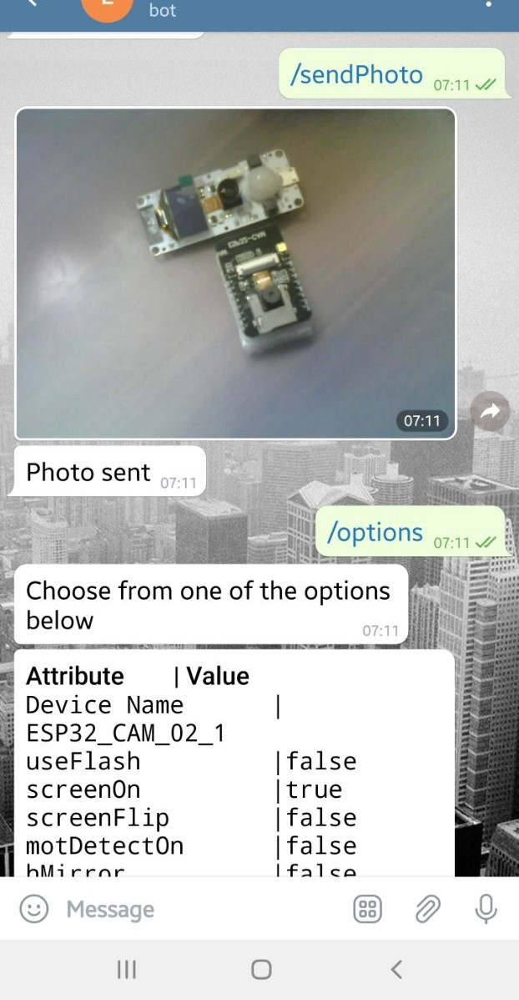
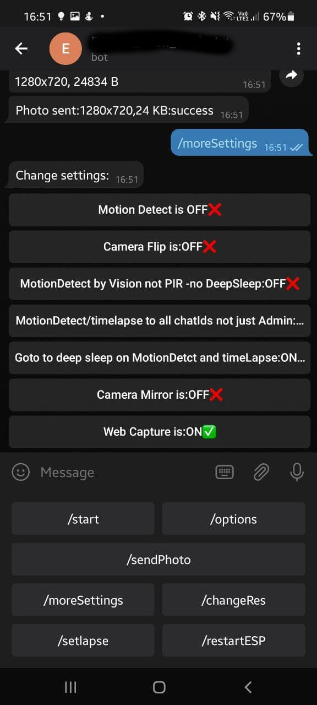
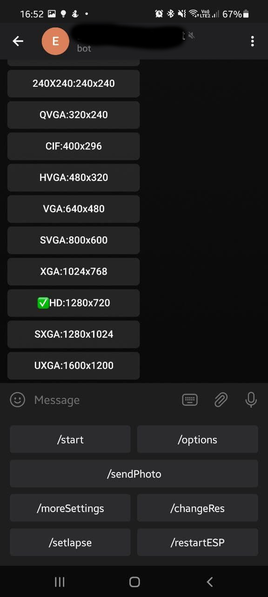
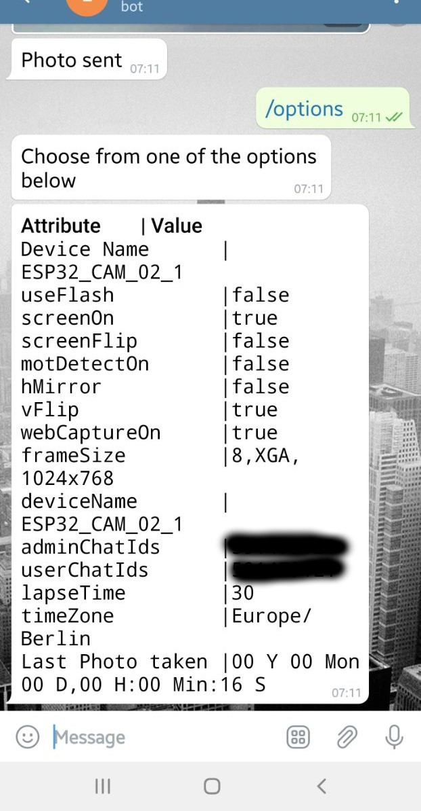
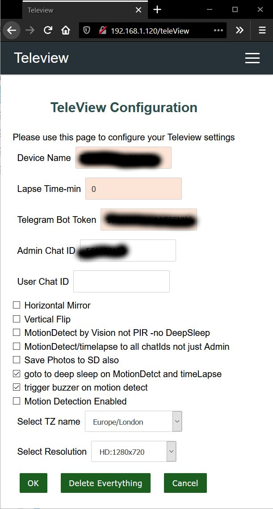

# TeleView:
	A telegram-bot project to control an ESP32-Camera enabled board with many features.

- [TeleView:](#teleview)
  - [Main features and snapshots](#main-features-and-snapshots)
  - [Generic Features:](#generic-features)
  - [Specific Features per Type of Board:](#specific-features-per-type-of-board)
  - [Tested Boards:](#tested-boards)
  - [Required Installation:](#required-installation)
  - [Required Libraries:](#required-libraries)
  - [User Guide:](#user-guide)
    - [Compile and Upload](#compile-and-upload)
    - [Enabling Disabeling Features at compile time](#enabling-disabeling-features-at-compile-time)
    - [Setting up the WiFi:](#setting-up-the-wifi)
    - [Setting up the Telegrambot:](#setting-up-the-telegrambot)
    - [OTA (it is there but doesnt work with all boards)](#ota-it-is-there-but-doesnt-work-with-all-boards)
    - [Having more than one user to use the bot:](#having-more-than-one-user-to-use-the-bot)
    - [Having multiple boards to use the same bot token:](#having-multiple-boards-to-use-the-same-bot-token)
  - [The Telegram Keyboard](#the-telegram-keyboard)
  - [A note about PIR motion Detection and Buzzer alerts:](#a-note-about-pir-motion-detection-and-buzzer-alerts)
  - [A note about Deep Sleep:](#a-note-about-deep-sleep)
  - [The Configuration Web interface](#the-configuration-web-interface)
    - [http://TeleView.local/](#httpteleviewlocal)
    - [http://TeleView.local/_ac](#httpteleviewlocal_ac)
    - [Intput Text](#intput-text)
    - [CheckBoxes:](#checkboxes)
    - [ComboBoxes:](#comboboxes)
    - [Buttons:](#buttons)
  - [Sending Emails](#sending-emails)
## Main features and snapshots
* Send Photo through telegram upon request. 


* Control camera options through Telegram Keyboard


* Control camera resolution Inline keyboard:


* View options through Telegram 


* Web interface



## Generic Features: 
* Sends Photo through telegram upon request.
* The telegram bot responds to the ADMINID or UserID (find your telegram CHATID through https://web.telegram.org/#/im?p=@chatid_echo_bot )
* Control options with Telegram :
	* Generic features: Camera Resolution, Camera-Flip ,Camera-Mirror ,image-resolution ,Time-Lapse and send photo.
	* Board Specific Features: Flash ,OLED display enable, OLED as Flash, Screen Flip,Motion Detector.
* Telegram Keyboard.
* AutoConnect / WiFi config feature (no hard coding of the WiFI SSID,Pass )
* Web Portal :
	* to configure the control options and WiFi AP.
    * configure Telegram-BOT-Token, AdminID of the BOT
* Web Server for /capture.jpg to make photo available through web. (configurable through Telegram menue)
* The Device-Name (configurable) decides the hostname of the device on LAN/WiFi
* Time Lapse feature every X min, chose 0 to disable Time-Lapse.
* A deep sleep mode is possible with time-lapse and PIR motiion detection for battery operated scenarios.
* Usual case , only the admin will be notified of the eventd "Alive", "motion detection" and "time-lapse" , but you can also enable alerting of the userId.
* Supports multiple Admins and multiple Users through Telegram Groups (explained further below).
* OTA Features (In progress)
* Send Email With Photos
* Supports OV2640 & OV3660 resolutions

## Specific Features per Type of Board:
* toggle flash when taking a photo : For the AI_Thinker board, there is a very strong led on the same side as camera, which could be used as a flash.
This feature Will only be compiled in the sketch if the "#define CAMERA_MODEL_AI_THINKER"  is chosen upon compile.

* PIR motion detection : For the TTGO_TI board, there is a motion sensor , which could trigger a "sendPhoto". This will only be available when the sketch is compiled with "#define CAMERA_MODEL_TTGO_T1_CAMERA".

* toggle Display : For the TTGO_TI board, there is a SSD1306 OLED display, which could display AutoConnect - AP , IP when connected and used as a weak-flash when taking a photo.
This will only be available when the sketch is compiled with "#define CAMERA_MODEL_TTGO_T1_CAMERA". also you could flip the screen upside-down.

* Save photos to SD as a configurable feature. file name by date-time.

## Tested Boards:
* AI-Thinker ESP32-CAM Board
* TTGO T1 Board
* M5STACK CAM
* M5Stack Camera-Timer-X/F

## Required Installation:
* Arduino IDE
* ESP32 for Arduino IDE https://github.com/espressif/arduino-esp32

## Required Libraries:

* TeleView was tested/compiled with these library versions. Just use the latest and if you face problems, then downgrade to those versions (more about this after the table)

Library | Version
--------| ---------
ESP32 board libs (in the board manager) | 1.0.6
UniversalTelegramBot | 1.3.0
ArduinoJson | 6.19.4
Adafruit GFX Library  | 1.11.3
Adafruit  BusIO | 1.14.1
Adafruit  SSD1306 | 2.5.7
AutoConnect | 1.4.0
ESP Mail Client(Mobizt) | 2.7.0

### A note about the ESP32 core Libraries:
Online, there are two URL's to be added to the Arduino Prefrences -> "Additional Board Managers URL"
1. this one is the normal and mentioned everywhere : https://dl.espressif.com/dl/package_esp32_index.json
   this allows the installtion of ESP32 core up to 1.0.6
   Teleview project uses The ESP32-CAM API 1.0.6 .
2. this one which is mentioned by Espressif: https://raw.githubusercontent.com/espressif/arduino-esp32/gh-pages/package_esp32_index.json .
   This one allows for more version, up to 2.0.3 (till the time of writing this).
   Also Allows ESP32-S2, S3 and C3 boards.
   Teleview project is not compatible The ESP32-CAM API beyond 1.0.6. 
   Some how there are breaking changes introduced in 2.0.0 !

Version 1.0.6 works fine from both sources. However, from version 2 upward (availbale only on the 2nd link), 
a lot of exceptions and stack traces appears.

> I recommend using ESP32 Core Libs version 1.0.6 from this link: https://dl.espressif.com/dl/package_esp32_index.json
  


## User Guide:
### Compile and Upload
 This project is Compiled and uploaded through ArduinoIDE, use the normal procedure for installing ESP32 in ArduinoIDE and install the following Libs:
*    AutoConnect
*    ArduinoJson
*    Adafruit SSD1306 and Dependecies such as Adaruit GFX..etc
*    please check the required libraries section above.

Before uploading, chose the target ESP32-CAM Board :

in Teleview.ino:
```CPP
// Select camera model
//#define CAMERA_MODEL_WROVER_KIT
//#define CAMERA_MODEL_ESP_EYE
//#define CAMERA_MODEL_M5STACK_PSRAM
//#define CAMERA_MODEL_M5STACK_WIDE
//#define CAMERA_MODEL_AI_THINKER         // Board definition "AI Thinker ESP32-CAM"
#define CAMERA_MODEL_TTGO_T1_CAMERA      // Board definition "TTGO T1" 
```

### Enabling Disabeling Features at compile time
The "camera_pins.h" has the speces of each board pins and also supported features such as OLED , Flash ..etc
This code has been tested on CAMERA_MODEL_AI_THINKER and CAMERA_MODEL_TTGO_T1_CAMERA modules. please update the camera_pins.h for other boards and more features.
For the CAMERA_MODEL_TTGO_T1_CAMERA borad, please chose the "TTGO T1" and and set Tools-> Partiton Scheme --> Huge App (3MB No OTA/1MB SPIFF)

For example: in "camera_pins.h" inside the section "#elif defined(CAMERA_MODEL_TTGO_T1_CAMERA)", you will find these precompilers:
* #define SDA_PIN 21
* #define SCL_PIN 22

* #define I2C_DISPLAY_ADDR  0x3c
* #define USE_OLED_AS_FLASH 1 // the OLED is on the same side as the camera
* #define PIR_PIN           33 //GPIO_INPUT_IO_33 AS312

* #define BUTTON_PIN        34

Also a section exists if an Active Buzzer is connected which is triggered with the motion detection.

These precompiler defines, are used upon compilation to utilize or ommit parts of the code depending on the features of the board.

### Setting up the WiFi:
This sektch uses the Autoconnect Arduino library (https://github.com/Hieromon/AutoConnect) to let the user configure WiFi SSID and Password at runtime.
When the sketch starts, it looks for a familiar WiFi. If it can't find one, it will start its own Access Point where the owner can connect and configure the WIFI. 

> First Time installtion: SSID will be "TeleView" with the password "tv-ei-694"

The AutoConnect library will start a portal with the page /config to configure the Wifi and other configuration parameters.

After a scucessfull Wifi connection, the same portal interface will be exposed to the local Wifi. The borad couled be reached on the LAN through the address "{{The Device Name}}.local"

The default Device Name is Teleview and the address would be:
* http://TeleView.local/  : A general Info page
* http://TeleView.local/_ac : The Configuration Portal for AutoConnect
* http://TeleView.local/teleView : The Configuration Portal for The Bot
* http://TeleView.local/capture : a capture of the camera JPEG

### Setting up the Telegrambot:
A Telegram-bot-token is required to use the Telegrambot feature. 
You may follow these instructions to get a Telegram Bot Token through the @botFather.
https://docs.microsoft.com/en-us/azure/bot-service/bot-service-channel-connect-telegram?view=azure-bot-service-4.0

* You will also need to find out your UserId, or in Telegram it is refered as ChatID.
This could be acquired through a visit to the @chatid_echo_bot Telegrambot https://web.telegram.org/#/im?p=@chatid_echo_bot 
* Insert the token and the ChatID of the Admin in the web-interface found at the url "http://<youDeviceAddress>/teleView" and save.
* Add the Bot to your telegram contacts.
* Reset your board and you should get an "I am Alive!" messgae from your bot.

### OTA (it is there but doesnt work with all boards)
* Through the Autoconnect Library, Teleview supports OTA.
* by default OTA is disabled. You can trigger it from Telegram , but you can upload the new firmware from the webUI.
* To enable OTA, use telegram's /moreSettings button and from the inlinekeyboard, "Enable OTA".
* Go to webUI and a new tab will appera with page title "Update". it wil have a browse and upload buttons use them upload the new bin file from the next  step.
* Then follow these Instructions to generate the new bin file :  https://hieromon.github.io/AutoConnect/otabrowser.html#how-to-make-the-binary-sketch
* once the new firmware is uplaoded and implemented, the ESP will Reboot and OTA will be disbaled again. 
* OTA configuration item is not stored. The ESP will boot up with status disabled by default.

### Having more than one user to use the bot: 
Q) If you are a family and would like to have two or more people access and manage the Telegram bot. how can this be preformed?
Q) if I have multiple Bots and want to controll all of them from one chat group ?

Answer-A) 
Use the Admin_id and User_id for the second user. However, remember that following events are sent only to the chat with the Admin_id:
* I am Alive message
* Motion Detection 
* Time-Lapse

Answer-B) 
> this is cool, you shoul really try it !
Using Telegram Groups:
  1) Create a Telegram group. Let us call it MyCameraBotGroup.
  2) The MyCameraBotGroup has now only you as an administrator.
  3) Add the bot(s) you want in that group and make them admins.
  4) Add your other family members in that group as well and make them admins (if you want them to also send commands).
  5) Edit the rights of the Bots and Members as you please.
  6) type /start in the MyCameraBotGroup group.
  7) the bot(s) will respond with the chat ID of the MyCameraBotGroup (notice the chat_id of the group has a negative number) for example  ('' from -1234567890..)
  8) Now go to the WebUI and put the chat_id of the group (don't forget the negative sign) in the "Admin Chat ID" textbox.
  9) Now anyone in that group can request a photo with /sendPhoto and other options as the same when using a single user.
  10) All "I am Alive!" events, Motion Detection and time lapse activities will be sent to that group as well.

### Having multiple boards to use the same bot token:
As far as I tested, this also works as a way to manage multiple boards at the same time. However you will not be able to figuire out which board is sending the "photo" , "I am Alive!" ,options or "motion detected" events.
## The Telegram Keyboard
Most of the buttons in the telegram Keyboard are on/off options. 

Feature 	  |   Description
:------------ |  :----------------
/start		  | 	Press this on the first time you use the bot , it will show some helpful info.
/options    | 	Will show the current status of the differnt options and flags.
/sendPhoto  | 	Sends a photo to the requester.
/vFlip	  |	Flips the camera-image upside down.
/hmirror    |	Mirror the camera-image . (unfortunately; there is no 90 degrees rotate )
/setLapse   | 	It will ask to insert the lapse time in minutes. insert 0 to disbale, 60 for every 1 Hour, 1440 for once a day ...etc
/webCaptureOn	|	This will disbale/enable the ./capture and ./capture.jpg urls.

Will only be shown in TTGO_T1 : (or when an old display is enabled in camera_pins.h)
Feature 	  |   Description
:------------ |  :----------------
/screenOn	  |	Use the screen to display useful information or switch it off.
/screenFlip	  |	Flips the screen upside down.
/motDetectOn  |	Will enable/disable PIR motion detection feature.

Will only be shown when an OLED or Flash led available: (or when enabled in camera_pins.h)
Feature 	  |   Description
:------------ |  :----------------
/useFlash	  |	 will enable/disbale using the flash upon a camera snapshot.

Other Custome Fatures:
Feature 	  |   Description
:------------ |  :----------------
/saveToSD       | Save Every photo taken to an SD as well as send it to telegram
/useBuzzer      | Trigger Buzzer whne motion is detected.

Other Generic Fatures:
Feature 	  |   Description
:------------ |  :----------------
/useDeepSleep   | Goto Deep sleep between timelapse ticks and PIR motion detection
/motionDetectVC | Use Computer Vision (CV) for motion dection
/alertALL       | Alert both Admin Id and Chat ID
/sendEmail      | sends emails to up to 2 emails (with Photo)

## A note about PIR motion Detection and Buzzer alerts:
1) IN ESP32-CAM AI Thinker the Buzzer and PIR are usually connected to PIN 12 and 13 which are also used for the SD card communication. so please pay attention in case you have issues afterwards.
2) PIR PIN could be connected to other sensors. Example: a reed switch ( door opening) , a button , a laser tripwire ..etc
3) Buzzer PIN could be connected to any other External Alert. Example: a siren , a water pistol , a nerf gun ..etc

## A note about Deep Sleep:
Deep sleep will be only utilized if one of those options is enabled:
1) PIR motion detection
2) time-lapse

Deep Sleep puts the ESP into sleep mode. so don't expect it to respond to any of your Telegram commands during its sleep.
Deep Sleep will not play well with those features:
1) CV motion detection , since it uses the Camera and the microcontroller to make constant checks of the frame changes.
2) WebCapture for the obvious reasons.

if it happens you put the ESP into Deep sleep and somehow you chnaged your mind, then follow these steps:
1) issue the command "/setLapse" by typing it or clicking the button.
2) restart your ESP from the physical button on the board or by disconnecting and then connecting it again.

## The Configuration Web interface

### http://TeleView.local/ 
This root home page displays a preview of the camera and some basis info. The cog-wheel icon is a link to the AutoConnect portal.

### http://TeleView.local/_ac 
The Autoconnect portal configures the WiFi access and has a link to the bot's configuration page "./teleView". It has the following elements:

Please note the below list is not exahustive.

### Intput Text
|UI Control          | Description
|:-------------------| :-----------
|Device Name         | The name of the device , this will be used as a DNS entry in the local LAN and identifying the device.
|Lapse Time-min      | Every X min , the board will send a photo to the admin. set this to 0 to disbale time-lapsing feature.
|Telegram Bot Token  | This is the token you get from the BotFather.
|Admin Chat ID       | Telegram commands will only be processed if the Chat_id of the incomming Message is the same as this Admin_id or User_id ( a Security feature ). This could be chat_id of a Person or a Group where the bot is registered as admin.
|User Chat ID        | a second chat_id for controlling Teleview .Motion detection , time lapse and "I am Alive!" message will only be addressed to the AdminID. This could be chat_id of a Person or a Group where the bot is registered as admin.

* If the chat_Id of the incomming message doesn't match either Admin_ID or User_id, then an echo message will be sent back with the chat id of the sender.
### CheckBoxes:
Checkbox | Description
:--------| :------------
Use Falsh when snapping a photo	| 	Enable/Disable using the flash when capturing a photo.
Horizontal Mirror				|	Horizontal Mirror effect on the captured image (left-right).
Vertical Flip					|	Upside down effect on the Captured image.
Screen Flip					|	Upside down of the OLED display.
OLED Display is On			|	Enable/Disable The OLED display.
Motion Detection Enabled		|	Enable/Disable the Motion Detection Feature.
...

### ComboBoxes:
ComboBoxes | Description
:--------| :------------
Select TZ name 		|	Select the Time Zone region (currently used for naming files stored on SD card)
Select Resolution 	|	Select the Camera Resolution. (never use the QXGA)

### Buttons:
Buttons | Description
:--------| :------------
OK 					|	Submit and Save the configuration.
Delete Everything	| 	Deletes all configuration data. except Wifi credentials.
Cancel				| 	Go back to AutoConnect Portal without saving.

## Sending Emails
In The configuration Page, you can set up the email sending feature through SMTP server.
I do not recommend to sed emails from your mail email account, rather create a new email account dedicated for sending photos only. the password is stored plain text in the flash.

Example:
Gmail SMTP Server Settings
If you’re using a Gmail account, these are the SMTP Server details:

SMTP Server: smtp.gmail.com
SMTP username: Complete Gmail address
SMTP password: Your Gmail password
SMTP port (TLS): 587
SMTP port (SSL): 465
SMTP TLS/SSL required: yes

Outlook SMTP Server Settings
For Outlook accounts, these are the SMTP Server settings:

SMTP Server: smtp.office365.com
SMTP Username: Complete Outlook email address
SMTP Password: Your Outlook password
SMTP Port: 587
SMTP TLS/SSL Required: Yes
Live or Hotmail SMTP Server Settings
For Live or Hotmail accounts, these are the SMTP Server settings:

SMTP Server: smtp.live.com
SMTP Username: Complete Live/Hotmail email address
SMTP Password: Your Windows Live Hotmail password
SMTP Port: 587
SMTP TLS/SSL Required: Yes

## The computer Vision Motion Detection
> this is an experimental feature, and I could use some help testing and refining it.
I have been looking around for a mature library online for the ESP32 that is flexible and expandable in the CAM boards that it supports.
But unfortunately, I couldn't find anything I could use. so I hade to build a simple-toy-algorithm in motionDetect.h by my self.
* It works by:
  * taking two consequetive GRAYSCAL 320x240 frame captures. 
  * counts the number of BLACK, WHITE , GRAY pixels in each frame.
    * Black Pixels have teh value of 0 to 85
    * White Pixels have the value of 255-85 to 255
    * the Gray Pixels have the value of 85 to 255-85
* Compare the number of BLACK, WHITE, GRAY Pixesl, and if there is difference of more than XX % percent to the total count of pixels between the frames, then an alert is triggered.
* So far, there are two control parameters that are configurable through the WebUI:
    * The Interval between the two consequetive frame captures in ms (i.e. 500 = half a second)
    * The percentage of change in previous frame pixels and current frame pixels.
* One important use I could have; is to identify day and night and decide whether asnapshot should be taken or not during using the timelapse features. (not yet implemented)

## capture and streaming
There are three enpoints for jpeg capture and streaming.

  > It is highly recommended **NOT** to contact the ESP with more than one client at the same time.

### streaming : /streaming
This will stream in MJPEG as fast as it can. 
However, it will check for the telegram events every 25 frames which will make it a bit choppy.
The code will auotmatically stop of the client is closed (once you close the browser tab or move to a another endpoint)
  > Content-Type: multipart/x-mixed-replace;boundary=...

The CV motion detection will produce alot of false events during the streaming.
I recomend to deactivate CVMotionDetect feature during streaming.

### Capture as an image : /capture
will send a jpeg  with the header: ( the picture will be displayed directly in the brwoser )
  > Content-Disposition:inline; filename=capture.jpg

### Capture as an atatchment jpg file: /capture.jpg
will send a jpeg  with the header: (as an attachement or downloadable file)
  > Content-Disposition:attachment; filename=capture.jpg


